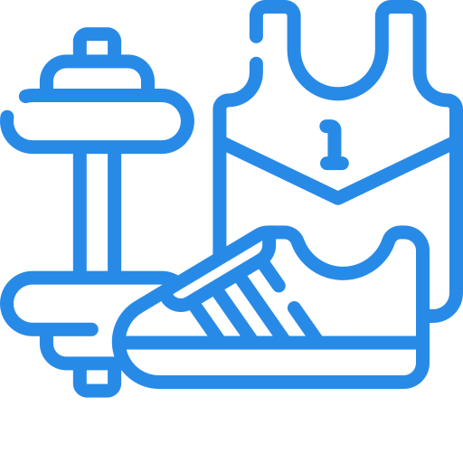

<h1 align="center" style="font: Poppins; font-style: bold; font-size: 28px; color: #288AE7;">
Hello! I'm Aleksandra👋 
<br>
  <a href="https://git.io/typing-svg">
    
  </a>
</h1>


```javascript
const aleksandra = {
    currentLocation: ["Manchester, UK"],
    role: ["Software Engineer"],
    languages: ["English", "Polish", "Spanish"],
    programmingLanguages: ["Javascript", "Python"],
    technicalSkills: {
        frontEnd: ["HTML5", "CSS3", "JavaScript", "React", "Next.js", "jQuery", "Bootstrap + React Bootstrap"],
        backEnd: ["Node.js", "REST APIs", "Python", "Django", "Django REST"],
        databases: ["MySQL", "MongoDB"],
        tools: ["Git", "GitHub", "Heroku", "VSCode", "Jira", "and more..."]
    },
    currentFocus: ["TypeScript", "React"]
};

```
<br>

## Hobbies
<p float="left">
 





</p>

## Get in touch
<a href="https://www.linkedin.com/in/aleksandrahaniok/"></a>
<a href="mailto:aleksandracoding@gmail.com"> </a>

## Here's some humor for you...</h2>


<p align="center">

</p>
<hr>
<p align="center">
  
</p>
